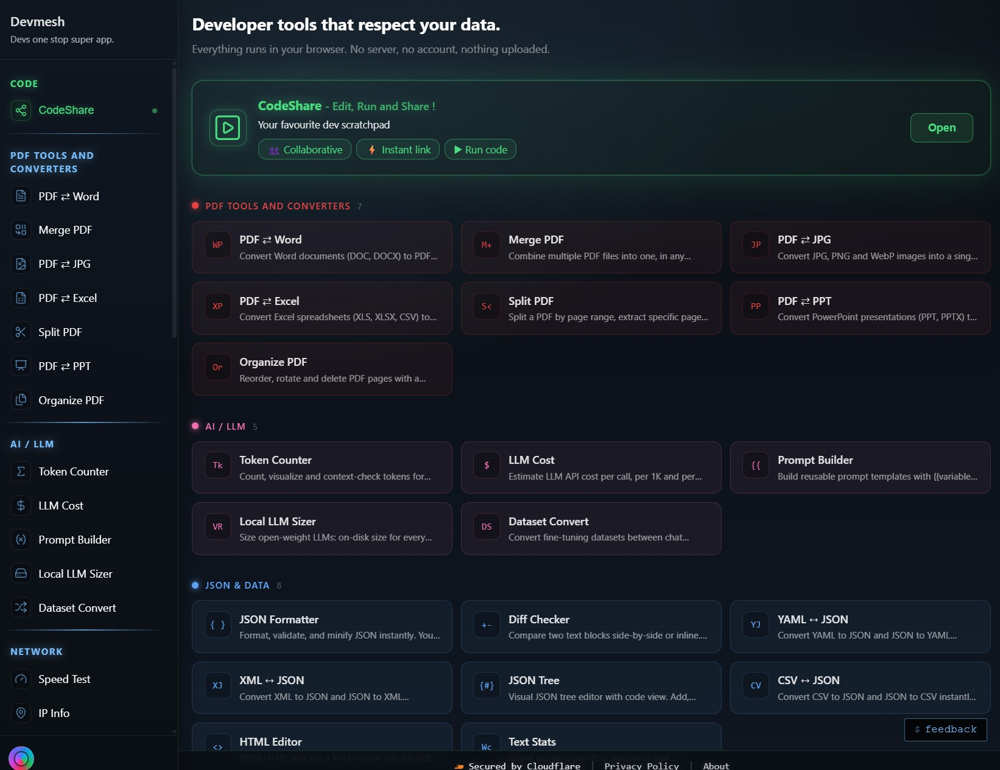
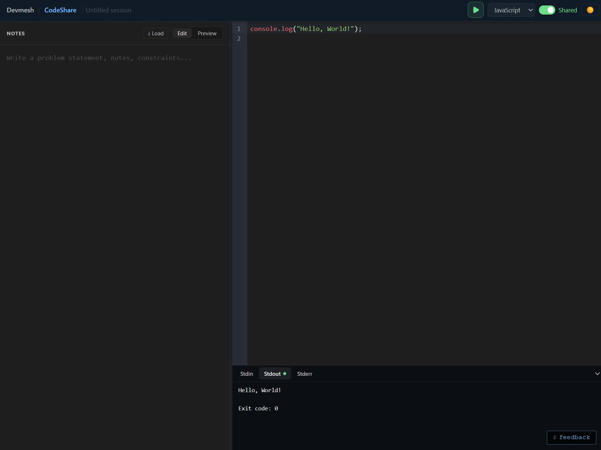
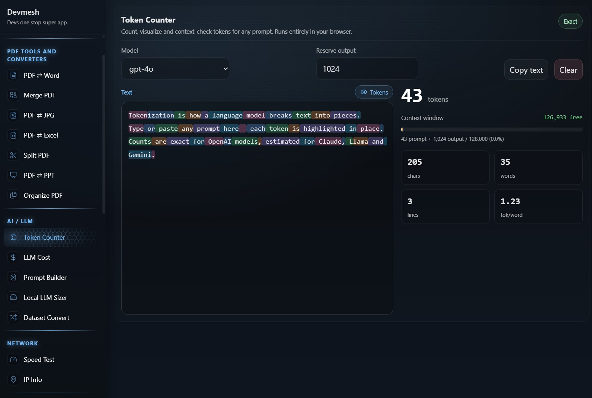
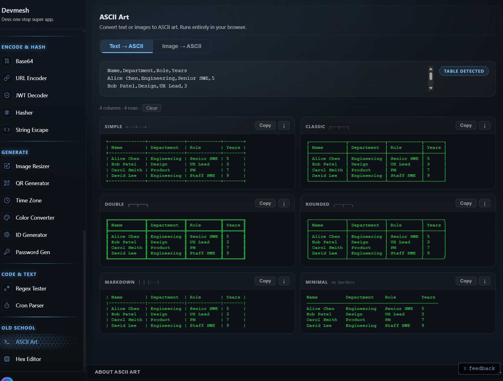
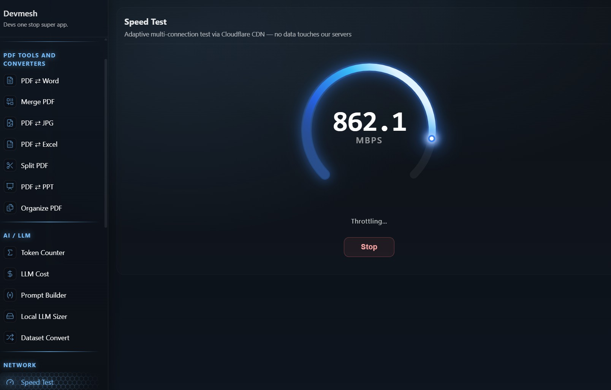

# Devmesh

> **Privacy-first developer tools, PDF & file converters, and a real-time collaborative code editor — all in your browser. No signup, no upload.**

### 🔗 [**Try it live → devmesh.me**](https://devmesh.me)

---

## What is Devmesh?

Devmesh is an all-in-one toolbox of **35+ developer and everyday tools** that run **right in your browser** — fast, private, and free. The client-side tools never upload your data; the document converters process securely on the server and delete your file right after. No accounts, no tracking, no friction.

## ✨ Highlights

- 🔒 **Privacy-first** — browser tools run locally; nothing is uploaded
- ⚡ **No signup, no account** — open and use, instantly
- 📄 **PDF tools & converters** competitors charge for — free
- 👥 **CodeShare** — real-time collaborative code editor with live execution
- 🧰 **One place** for the tools you'd otherwise hunt across 20 sites

## 🧰 What's inside

**📄 PDF Tools & Converters** — Merge · Split · Organize · Word→PDF · PDF→Word · Excel→PDF · PowerPoint→PDF · JPG↔PDF
👉 [devmesh.me/pdf](https://devmesh.me/pdf)

**🤖 AI / LLM** — Token Counter · LLM Cost Calculator · Prompt Builder · Local LLM Sizer · Dataset Converter

**{ } JSON & Data** — JSON Formatter · JSON Tree Editor · YAML ↔ JSON · XML ↔ JSON · CSV ↔ JSON · Diff Checker

**🔐 Encode & Hash** — Base64 · URL Encoder · JWT Decoder · Hasher (SHA/MD5) · String Escape

**⚙️ Generate** — UUID/NanoID · Password · QR Code · Color Converter · Time Zone

**🌐 Network & More** — IP Info · Speed Test · Regex Tester · Cron Parser · ASCII Art · Hex Editor

## 👥 CodeShare

A real-time **collaborative code editor** — share a single link, edit together live, and run code in 20+ languages. No signup.
👉 [devmesh.me/codeshare](https://devmesh.me/codeshare)

## 📸 Screenshots

| | |
|:---:|:---:|
| **CodeShare** — collaborative editor | **Token Counter** — AI / LLM tools |
|  |  |
| **ASCII Art** generator | **Speed Test** |
|  |  |

## 🔒 Privacy

Browser-based tools never send your data anywhere. Server-side document conversions travel over an encrypted connection, are converted, and **deleted right after — never stored**.

---

🔗 **[devmesh.me](https://devmesh.me)** · 📄 [PDF tools](https://devmesh.me/pdf) · 👥 [CodeShare](https://devmesh.me/codeshare)

© 2026 Aditya. All rights reserved.
